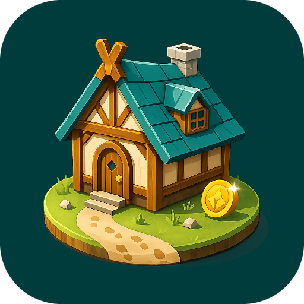

    <picture>
        <source
          width="200px"
          media="(prefers-color-scheme: dark)"
        >
        
    </picture>
     
    <b>Step Realm</b>
      
    <b>© 2026 by AEYCEN</b>
     
    Jeder Schritt baut dein Reich
     

---

**Step Realm** ist ein Android-Spiel, das Bewegung belohnt: Deine täglichen Schritte
werden zu Ressourcen, aus denen du Schritt für Schritt dein eigenes Dorf aufbaust.

**➡️ [Roadmap ansehen](https://aeycen.github.io/StepRealm-docs)**

## Über das Spiel

- 📱 Android-App (Kotlin, Jetpack Compose)
- 👟 Schrittzähler als zentrale Spielmechanik: Fortschritt entsteht durch echte Bewegung
- 🏠 Dorfaufbau mit Ressourcen, Gebäuden und Ausbaustufen
- 🎲 Tägliche Ereignisse, Streaks und wählbare Belohnungen
- 🏆 Wöchentliches Freunde-Leaderboard und Cloud-Save über Google Play Games

## Entwickler

Ein Spiel von **[AEYCEN](https://github.com/AEYCEN)**.

Feedback und Ideen zur Roadmap sind willkommen. Gerne per Discord: aeycen

## Inhalt dieses Repositories

Dieses Repository enthält die öffentliche Dokumentation des Projekts.
Der Quellcode der App selbst ist closed source nicht Teil dieses Repositories.

---

  

© 2026 AEYCEN · Step Realm

